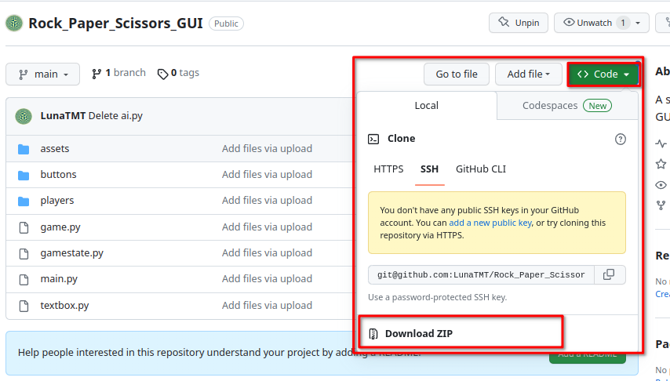
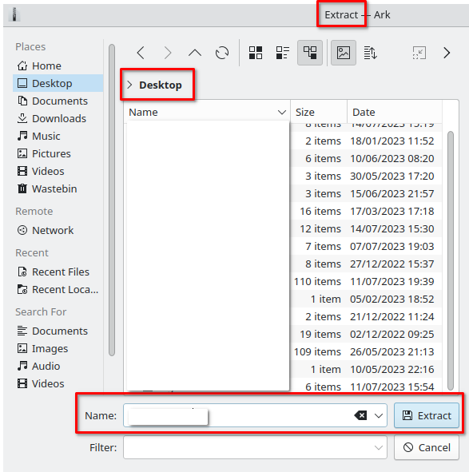
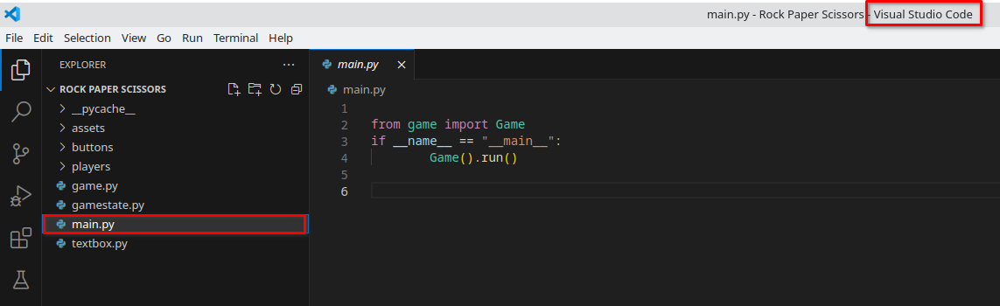
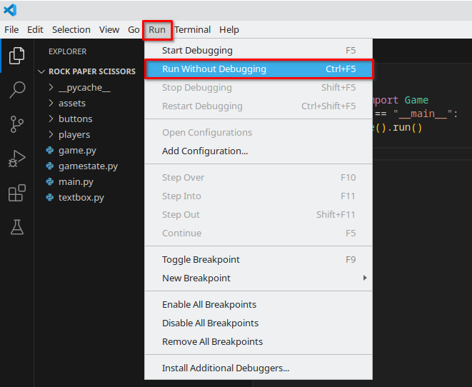

# Rock Paper Scissors

## Description

This project is a very basic Rock, Paper, Scissors game created with Pygame

## How to run

* Download the files from the GitHub repository

<figure><figcaption></figcaption></figure>

* Export the folder to a given location&#x20;

<figure><figcaption></figcaption></figure>

<figure><figcaption></figcaption></figure>

* Open the Tic Tac Toe folder in your chosen IDE and open up the main.py file

<figure><figcaption></figcaption></figure>

* Run this file by either navigating to the _'run'_ drop down menu in the top left and then selecting _'run without debugging'_ or run the file by your IDE's given shortcut (Ctrl + F5 for VSC)

<figure><figcaption></figcaption></figure>

* What the project does
* Why the project is useful
* How users can get started with the project
* Where users can get help with your project
* Who maintains and contributes to the project
