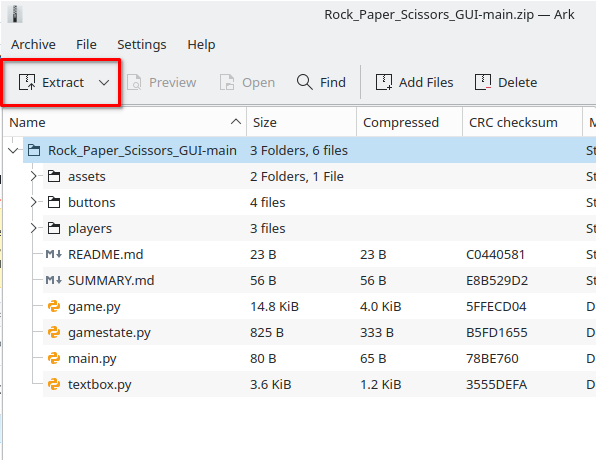

# Rock Paper Scissors

## Description

This project is a very basic Rock, Paper, Scissors game created with Pygame

## How to run

* Download the files from the GitHub repository

<figure><figcaption></figcaption></figure>

* Export the folder to a given location

<figure><figcaption></figcaption></figure>

<figure><figcaption></figcaption></figure>

* Open the Tic Tac Toe folder in your chosen IDE and open up the main.py file

<figure><figcaption></figcaption></figure>

* Run this file by either navigating to the _'run'_ drop down menu in the top left and then selecting _'run without debugging'_ or run the file by your IDE's given shortcut (Ctrl + F5 for VSC)

<figure><figcaption></figcaption></figure>

## Demonstration

### Menu

https://github.com/LunaTMT/Rock\_Paper\_Scissors\_GUI/assets/44672093/f07e40ca-f4cb-4985-9c55-0e32f9f549df

### User input

https://github.com/LunaTMT/Rock\_Paper\_Scissors\_GUI/assets/44672093/9d1c546e-8c44-4753-a3a6-db1879ebd6c9

### Game

https://github.com/LunaTMT/Rock\_Paper\_Scissors\_GUI/assets/44672093/c4ceb953-2c3f-4e1c-b1f0-5a5d459fd8c5

### Goals

I really wanted to implement networking and sockets into this project but I felt a little too overwhelmed when I began to delve into it, such that I felt it to be wiser to postpone this feature for a later date or another project. The sole focus became gaining more familiarity with pygame and OOP.

&#x20;If I were to implement this feature I would make an overly basic game without all the fancy animations to make it look nice and most likely without OO to begin with.&#x20;

I was hoping to implement another menu option, such as, _Player V.S. Player_ where one user could choose to be the server and the other player, the client, could join.

### Limitations

* The game is limited to playing strictly against a bot and not another person.
* Once the game window is closed and the program exited, all score and player data is lost

### Takeaways

From this project I've finally come to understand state transitions more and how they relate to finite-state machines and the main game-loop.

There is a lot of work to be done to create more robust and resilient objects, especially for the player class, but all the buttons created were well encapsulated and all inherit from a well defined consise parent class. The latter classes could quite easily be transfered to another project.

#### **Written - 14/07/2023**
